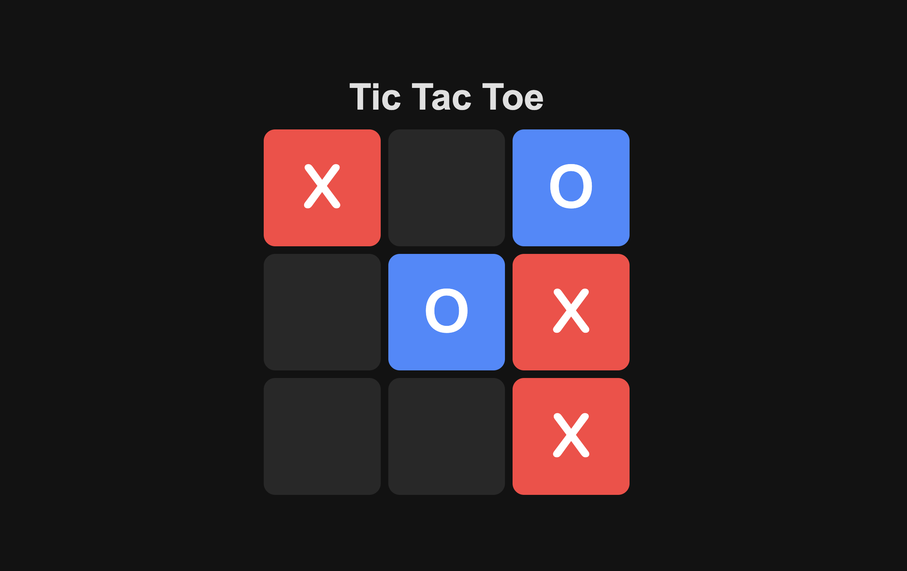

# Tic-Tac-Toe

A simple and interactive Tic-Tac-Toe game built using HTML, CSS, and JavaScript. This project allows two players to play the classic game in a responsive and visually appealing interface.



## Features
- Two-player mode with alternating turns.
- Visual indicators for player turns (X and O).
- Responsive design that adapts to various screen sizes.
- Dynamic win detection and game reset functionality.
- Overlay for displaying the game results (win/draw).

## Technologies Used
- **HTML**: Structure of the game.
- **CSS**: Styling and responsiveness.
- **JavaScript**: Game logic, event handling, and interactivity.

## Installation and Usage

### Clone the Repository
To run the project locally, clone this repository using Git:
```bash
git clone https://github.com/CoolDevXD/Tic-Tac-Toe.git
cd Tic-Tac-Toe
